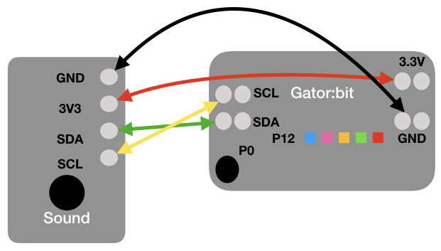
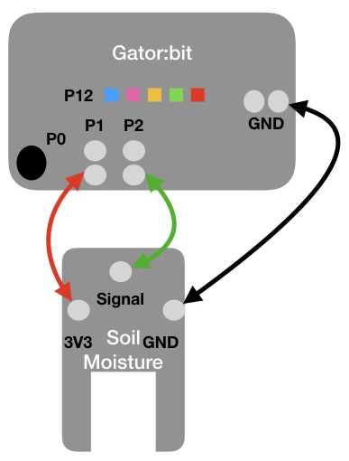

## Getting Started
This page presents an overview of the technology used in SchoolWide Labs and provides
links to additonal information and tutorials. It also walks you through a series of exercises that will help you get started.

### Micro:bit
The micro:bit is a microcontroller created by the BBC for use in K-12 Education. It can be programmed using a variety of block and text based programming
languages. For the SchoolWide Labs project, we use MakeCode which is a block based programming language that also allows students to program in javascript and python as they become more advanced. Below is a suggested series of exercises to familiarize yourself with the micro:bit. Complete these exercises before moving on to the Gator:bit and sensors.

1. Go to [Makecode](https://makecode.microbit.org/)
2. Complete the Blinking Heart tutorial
3. Complete one additional tutorial
4. Complete one of the Games (e.g. Rock, Paper, Scissor or Hot Potato). 

### Gator:bit
The gator:bit created by [SparkFun Electronics](https://www.sparkfun.com/) makes it easy to access additional pins on the micro:bit as well as provide 
some simple options for displaying information using lights (5 neopixel LEDs controlled
by Pin 12) and sound (piezo speaker controlled by Pin 0). For more information on the
the gator:bit along with some examples see the [hookup guide](https://learn.sparkfun.com/tutorials/sparkfun-gatorbit-v2-hookup-guide).

### Sensors
The micro:bit comes with some onboard sensors including a magnetometer and accelerometer.
In addition the micro:bit has a light sensor and temperature sensor, but those are not 
sufficiently accurate for use in scientific inquiry. To better support scientific inquiry,
SparkFun developed a set of sensors that can be attached to the micro:bit and/or gator:bit.
These sensors include a temperature sensor, a light sensor, an environmental
sensors (measures temperature, humidity, barometric pressure, carbon dioxide, and total volatile organic compounds),
sound sensor, particle sensor, UV sensor, and soil moisture sensor. In addtion, a real time
clock and SD card can be attached to support long term data collection. 

The Magnetometer, Environmental Sensor, Sound Sensor, and Soil Moisture Sensor are described below.
Information about the other sensors and the data collection will be added in the future.

#### Magnetometer
The magnetometer can measure magnetic force in three directions (x,y,z) and calculate
the strength of the magetnic field. When you use the magnetometer block, the micro:bit
will prompt you the calibrate the magnetometer before taking values. To access the magnetometer, go to 
the more section under the Input blocks on MakeCode. 

[This](https://makecode.microbit.org/_AXHMDffy932t) is an example program that increases the intensity of the LEDs on the micro:bit as the magnetic field gets stronger.

#### Environmental Sensor
The Environmental Sensor can measure temperature, humidity, barometric pressure, carbon dioxide, and total volatile organic compounds. The [hookup guide](https://learn.sparkfun.com/tutorials/sparkfun-gatorenvironment-hookup-guide/all) from SparkFun contains more information.

[This link](https://makecode.microbit.org/_0iaJP1Cj0hYr) is an example program that displays the temperature and humidity on the micro:bit. Wire the sensor using the wiring diagram below and test it out.

#### Sound Sensor
The Sound Sensor measures the presence or absence of sound as well as the intensity of the sound. The [hookup guide](https://learn.sparkfun.com/tutorials/sparkfun-gatormicrophone-hookup-guide/all) from SparkFun contains more information.

[This link](https://makecode.microbit.org/_P9ib4EdpTaJm) is an example program that displays the sound intensity using the LEDs on the micro:bit. Wire the sensor using the wiring diagram below and test it out.

<!-- .element height="60%" -->

#### Soil Moisture Sensor
The Soil Moisture Sensor measures how moist the soil is. The sensor returns a value between 0 and 1 depending on the moistness with values close to 0 very dry and values close 1 very moist. The sensor does need to be calibrated in the soil you plan to use because things like compactness and and soil composition can influence the readings. The [hookup guide](https://learn.sparkfun.com/tutorials/sparkfun-gatorsoil-hookup-guide/all) from SparkFun contains more information.

[This link](https://makecode.microbit.org/_26bP10Jb0EYH) is an example program that displays the soil moisture as a percentage on the micro:bit. Wire the sensor using the wiring diagram below and test it out.

<!-- .element height="60%" -->

